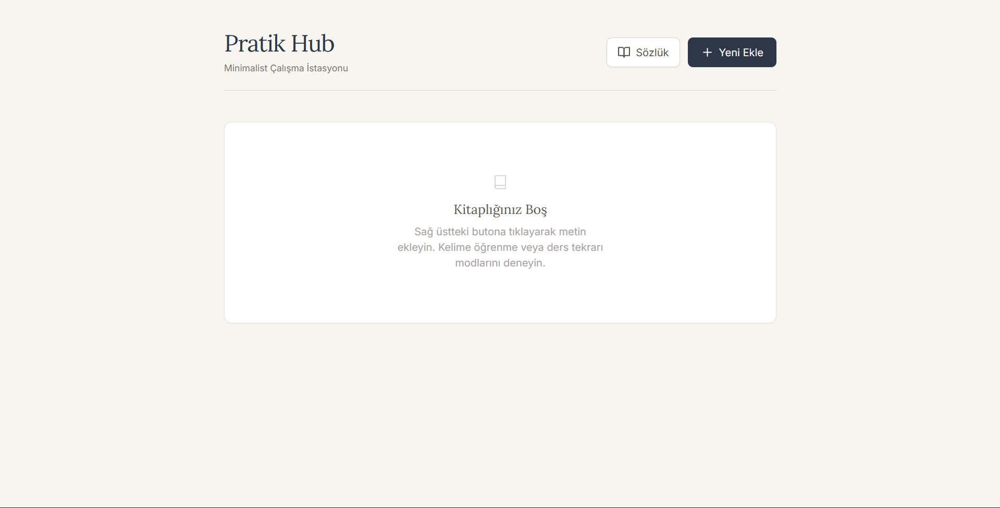
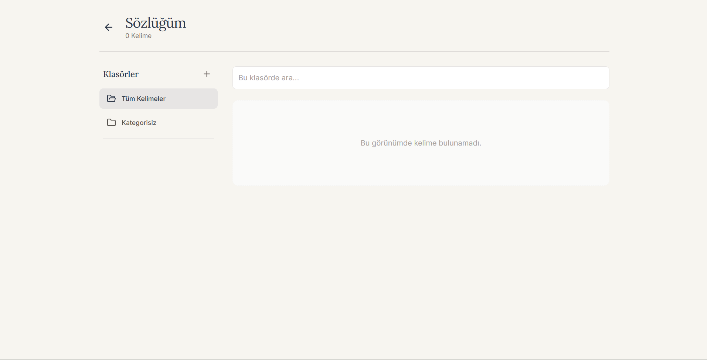
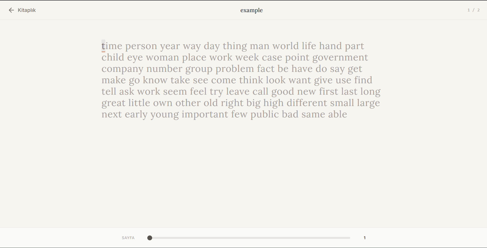
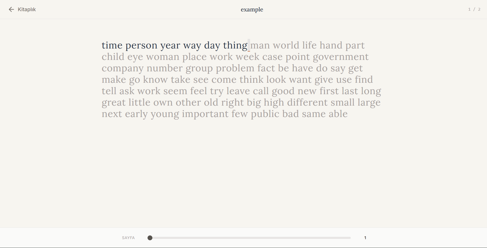

# Pratik Hub — Minimal Typing & Study Workspace

**Pratik Hub** is a minimalist web app for:
- **Typing practice** (progress only when you type the correct character)
- **Study review** with **colored highlights**
- Building a personal **dictionary** while reading

The app is **local-first**: your books, progress, and dictionary are stored in your browser.

---

## Screenshots

| Screen | Preview |
|---|---|
| Home / Library |  |
| Add screen |  |
| Dictionary |  |
| Example 1 |  |
| Example 2 |  |

---

## What you can do in the app

### Library (Home)
- Create your own library of texts (“books”)
- Add content by:
  - **Pasting text**
  - **Uploading a PDF** *(optional feature)*
- Choose a mode per book:
  - **Normal**: typing practice only
  - **Vocabulary**: select words and add them to your dictionary
  - **Study**: highlight important parts with colors
- Optional: set a **Repeat Count** to repeat the same text multiple times (memorization drills)
- See progress % for each book
- Delete books with confirmation

### Reader (Typing screen)
- Type text **character by character**
- You only move forward when you type the **correct** character
- Supports **Backspace**
- Page slider to jump inside the text

### Dictionary
- Save words while reading (Vocabulary mode)
- Search, edit meanings, and organize with folders

---

## Install & Run (Step-by-step)

### 0) Requirements (one-time)
You need:
- **Node.js** (LTS recommended)
- **Git** (only if you want to clone via terminal)

Check if Node.js is installed:
```bash
node -v
npm -v
```
If these commands fail, install Node.js from: https://nodejs.org/

---

### 1) Get the project on your computer

#### Option A — Clone with Git (recommended)
1. Open **Terminal** (macOS/Linux) or **PowerShell** (Windows)
2. Run:

```bash
git clone https://github.com/carus10/practice-hub.git
cd practice-hub
```

#### Option B — Download ZIP (no Git needed)
1. On GitHub, click: **Code → Download ZIP**
2. Extract the ZIP file
3. Open a terminal in the extracted folder (the folder that contains `package.json`)

---

### 2) Install dependencies
This downloads the libraries the project needs into a local `node_modules/` folder:

```bash
npm install
```

---

### 3) Start the development server
```bash
npm run dev
```

---

### 4) Open the app in your browser
After starting, the terminal will print a local URL.

Commonly:
- `http://localhost:3000`

(Always use the exact URL shown in your terminal.)

---

## Build (Production)
If you want a production build:

```bash
npm run build
npm run preview
```

---

## Data Storage (Important)
Pratik Hub stores everything in your browser’s **localStorage**:
- books
- typing progress
- dictionary words
- folders

If you clear your browser storage/site data, your data will be removed.

---

## Tech
- Vite + React + TypeScript
- TailwindCSS (via CDN)

---

## License
Add a license when ready.